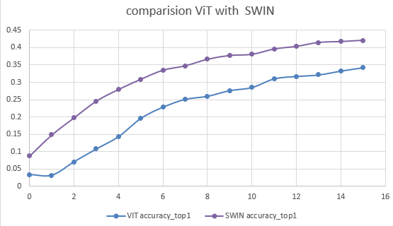

## swin_transformer_pytorch

This repository is to re-implement the swin transformer.

Please refer to https://arxiv.org/abs/2103.14030

we refer to the those repository thanks:

https://github.com/microsoft/Swin-Transformer
https://github.com/berniwal/swin-transformer-pytorch

## The implementation of this repository


1. Patch Partition
2. Swin Transformer Block
- W-MSA
- SW-MSA
3. Patch Merging

An analysis of the thesis can be seen in the following. (https://csm-kr.tistory.com/86)

## Experiments

#### Traning environment

```angular2html
- batch : 512 (paper : 1024)
- lr : 1e-3
- epoch : 300
- optimizer : adamw
- weight_decay : 5e-2
- lr scheduler : cosine scheduler(min : 5e-6)
- loss : LabelSmoothingCrossEntropy
```

#### to do list

- [X] imagenet
- [x] data augmentation 
- [ ] various models (tiny, base, large, ...)  
- [ ] Relative positional encoding

#### Imagenet1K

| Model   | Batch size | Resolution | Top1-Acc | Top5-Acc | Val Loss | Params           |
|---------|------------|------------|----------|----------|----------|------------------|
| SWIN(T) | 512        | 224 x 224  | -        | -        | -        | 28261000 (28.3M) |

learning...



It seems better than VIT at imagenet 1k classification 

## Start Guide

- Train
- Test

## Reference

https://github.com/microsoft/Swin-Transformer

https://github.com/berniwal/swin-transformer-pytorch


