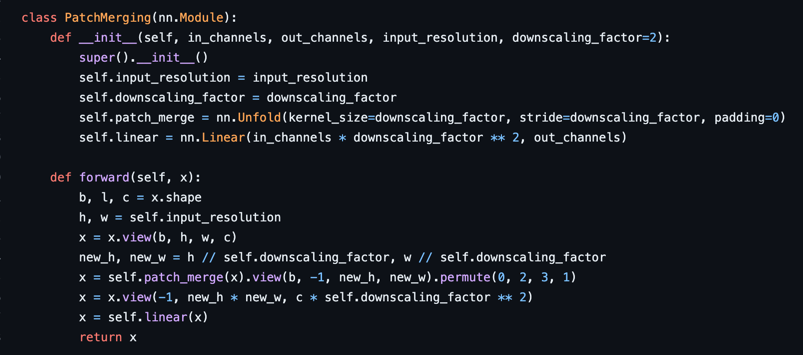

# swin_transformer_pytorch

This repository is to re-implement the swin transformer.

Please refer to https://arxiv.org/abs/2103.14030

we refer to the those repository thanks:

https://github.com/microsoft/Swin-Transformer

https://github.com/berniwal/swin-transformer-pytorch

## The implementation of this repository

1. Patch Partition

2. Swin Transformer Block
- W-MSA
- SW-MSA

3. Patch Merging

## Experiments

- [ ] imagenet
- [ ] data augmentation 
- [ ] various models (tiny, base, large, ...)  

